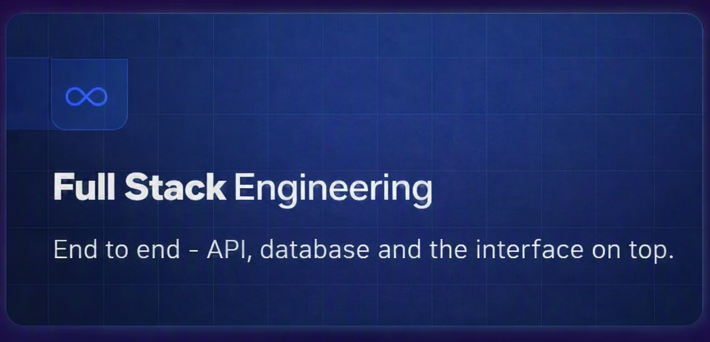
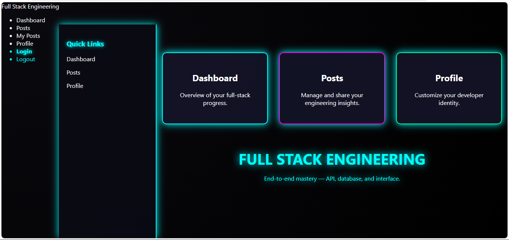
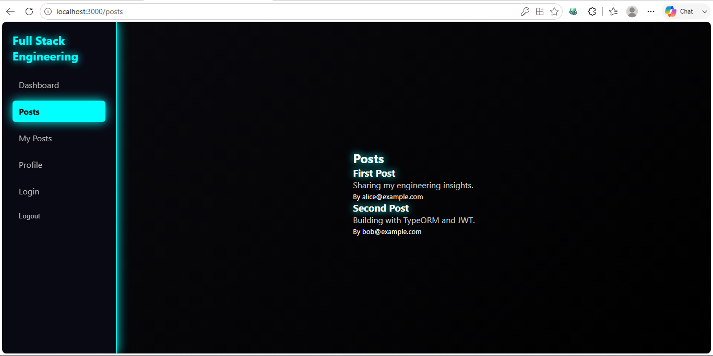
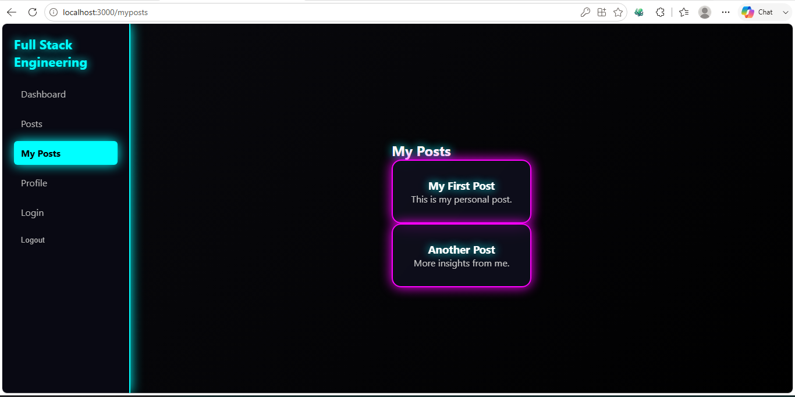
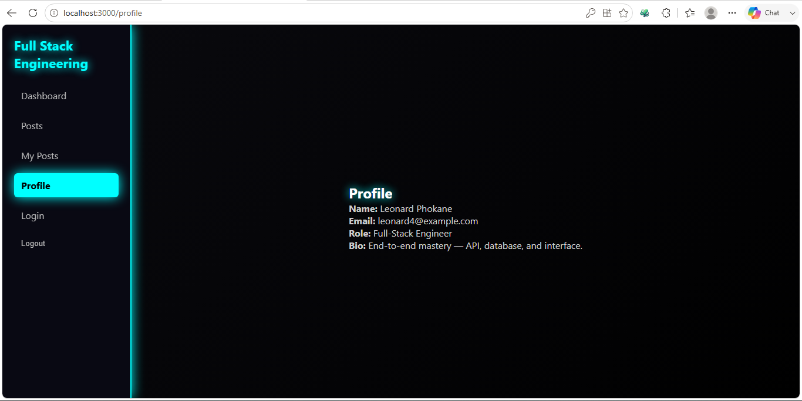
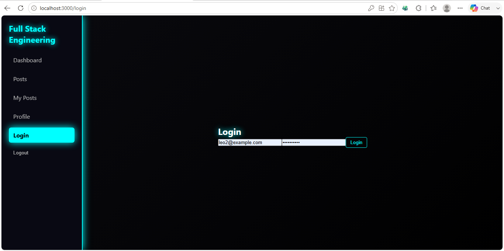

---

# Fullstack Internship App

A full‑stack application built for the CodingAtom internship assessment.  
It demonstrates end‑to‑end typed development with a **Node.js + Express + PostgreSQL backend** and a **React + TypeScript frontend** styled with a neon dashboard theme.

---

# 📸 Preview


## 📸 Screenshots

| Posts | MyPosts |
|-------|---------|
|  |  |

| Profile | Login |
|---------|-------|
|  |  |


---

## 🚀 Tech Stack
- **Backend:** Node.js, Express, TypeORM, JWT authentication, Railway Postgres
- **Frontend:** React, TypeScript, Axios, Neon dashboard UI
- **Testing:** Jest + React Testing Library
- **Deployment:** Railway (backend), Vercel/Netlify (frontend)

---

## 📂 Project Structure
fullstack-internship-app/
backend/
src/
tests/
frontend/
src/
tests/
README.md


---

## ⚙️ Setup Instructions


### 1. Clone the repo
```bash
git clone https://github.com/leonardphokane/fullstack-internship-app.git
cd fullstack-internship-app

```

### 2. Backend setup
```bash
cd backend
npm install

Create a .env file:

DATABASE_URL=postgresql://postgres:<password>@<railway-host>:<port>/railway
JWT_SECRET=supersecretkey
PORT=4000

```

Run backend:

```bash
npm run dev

```
### 3. Frontend setup
```bash
cd ../frontend
npm install
npm start
Frontend runs on http://localhost:3000 and talks to backend at http://localhost:4000.

```
---

## 🔑 Authentication Flow
Register or update a user in Postgres with a bcrypt hash.

Login via /auth/login → returns JWT.

Token is stored in localStorage and attached to all requests via Axios interceptor.

Protected routes: /posts, /myposts, /profile.

---

## 🧪 Running Tests

```bashFrom the frontend folder:


npm test
From the backend folder:


bash
npm run test

```

---

## 🌐 Deployment
Backend: Deployed on Railway (Postgres + Express API).

Frontend: Deploy on Vercel or Netlify.

Update frontend/src/api.ts baseURL to point to your deployed backend.

---

## 🎥 Demo
A short demo video is included in the LinkedIn post submission showing:

Login flow

Posts dashboard

Profile page

---

## 👨‍💻 Author


Leonard Phokane — AI/ML student & freelance full‑stack engineer.
Built as part of the **CodingAtom Fullstack Engineering Internship Assessment**.


